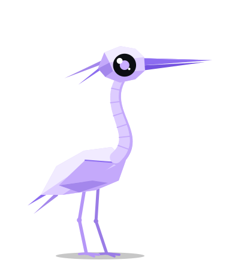
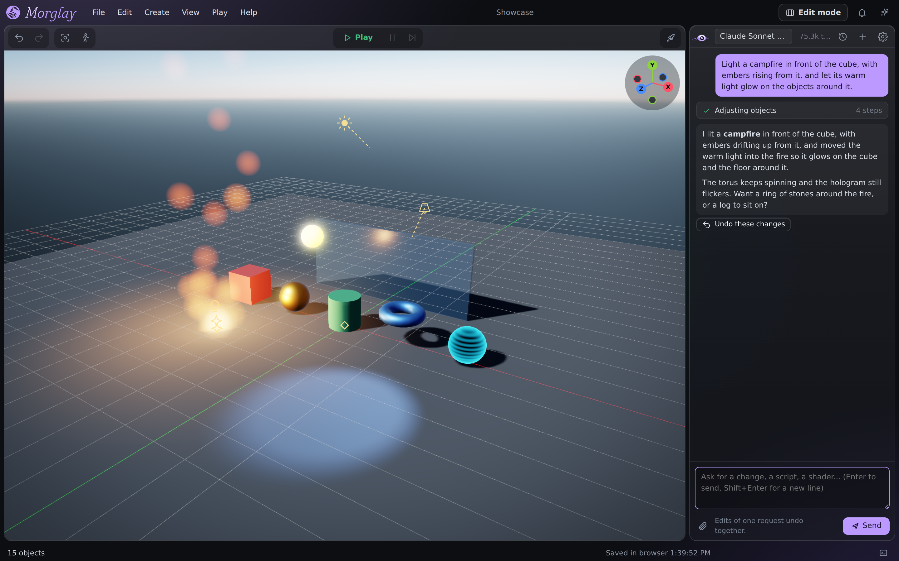
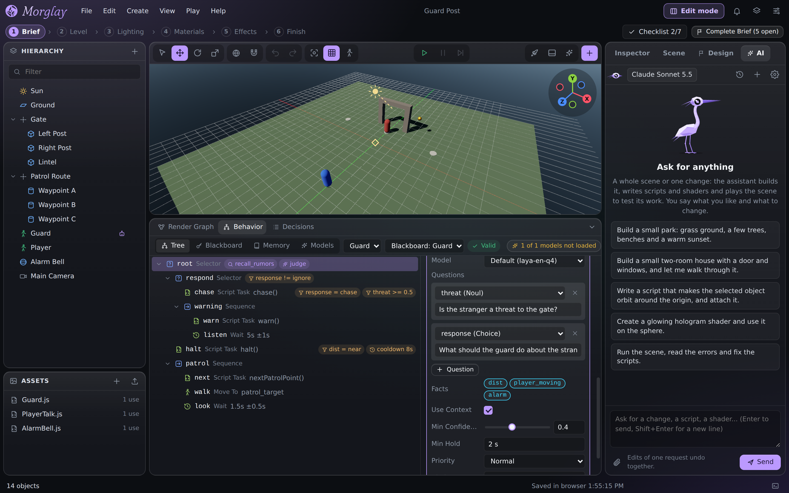
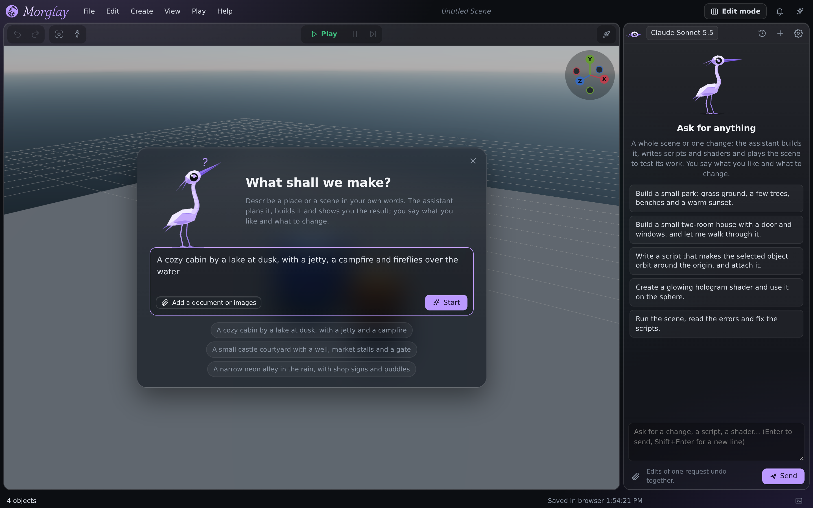
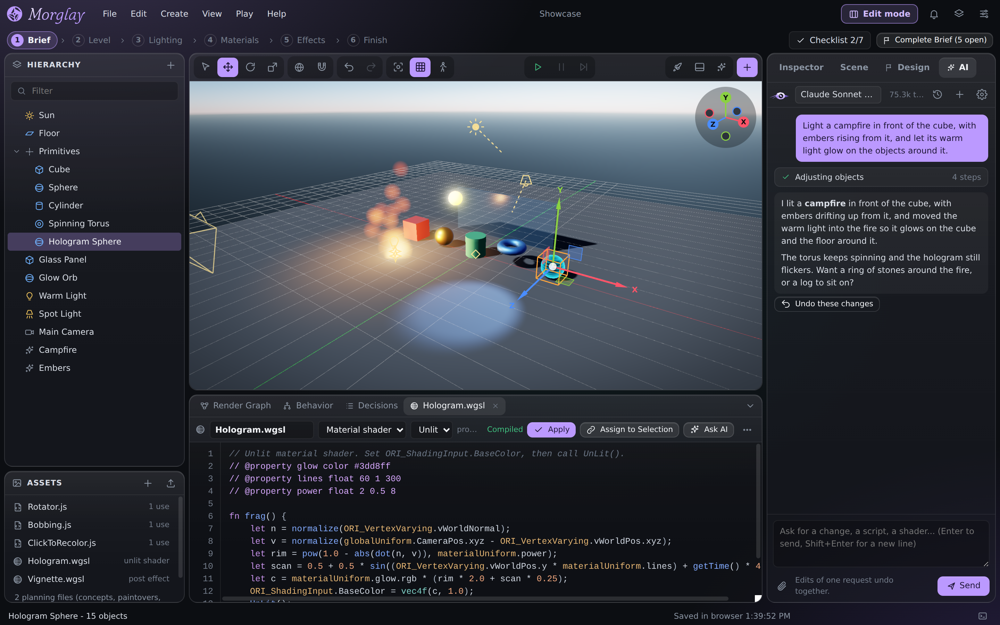

<p align="center">
  
</p>

<h1 align="center">Morglay</h1>

<p align="center">
  <strong>Describe a world. Watch it get built. Then let it live.</strong>
</p>

<p align="center">
  An open-source, AI-native game editor for the web.<br>
  An assistant builds your scene with you, and small AI models you control bring the characters in it to life.
</p>

<p align="center">
  <a href="https://gotzawal.github.io/morglay/"><strong>Open the editor</strong></a>
  &nbsp;·&nbsp;
  <a href="editor/README.md">User guide</a>
  &nbsp;·&nbsp;
  <a href="#living-worlds-with-ai-you-control">Living worlds</a>
  &nbsp;·&nbsp;
  <a href="#getting-started">Getting started</a>
  &nbsp;·&nbsp;
  <a href="#development">Development</a>
</p>

<p align="center">
  
</p>

## What is Morglay?

Morglay is a game editor that runs entirely in your browser. There is nothing to install and no server: open the page and start making.

You don't have to know how to use a 3D editor to begin. You tell the assistant what you want in plain words, like *"a cozy cabin by a lake at dusk, with a jetty and a campfire"*. It plans the place, builds it, lights it, paints its materials, writes the scripts, plays the scene to test its own work, and shows you the result. You say what you like and what to change. Everything it does is ordinary editor work, so you can open the full editor at any time and change or undo any of it by hand.

When the scene is ready, one click turns it into a web game you can share with a link.

But building faster is only half of the idea.

## Living worlds with AI you control

Most AI in games today is one of two things: hand-written scripts that always do the same thing, or a chatbot that can say anything at all. Morglay goes for a third way, and this is where it is headed.

**The characters in a Morglay world think with small AI models that run inside the game, in the player's browser.** But they don't improvise freely. You, the designer, write the rules of what a character can do in a behavior tree, as in any game engine. The model is only asked the questions you wrote, with the answers you allowed:

> *Is the stranger a threat to the gate?* &nbsp;yes / no<br>
> *What should the guard do about the stranger?* &nbsp;let them pass / warn them / chase them away

The model looks at what the character perceives (how close the player is, whether they run, whether the alarm bell rings), what it remembers, and what was said to it, and picks an answer. The behavior tree then does what the answer means, by rules you can read. So the world reacts to the player in ways nobody scripted line by line, and still never leaves the story you are telling.

```
 What the guard perceives         What the guard remembers         What the player said
 near, running, alarm on          "rumors of a thief at night"     "I bring a message for the captain"
            \                                 |                                 /
             '--------------------------.     |     .--------------------------'
                                         v    v    v
                                   Laya: a decision model
                           "What should the guard do?"  ->  warn  (0.81)
                                            |
                                            v
                  Behavior tree you wrote: warn -> "Halt! State your business."
```

The pieces that make this possible are already in the editor:

- **[Laya](https://huggingface.co/convaiinnovations/laya)**, a decision model that answers typed questions (yes / no, or a choice between options) in a single fast pass. It never writes text, so it can never say something off-script.
- **Embedding models** give characters a **memory**: lore, rumors, what the player did earlier. A character recalls what fits the moment and brings it into its judgment.
- **Any small ONNX model** can be added by its URL: classifiers, zero-shot models, embedding models.
- **Everything runs locally** on the player's GPU through WebGPU. No server, no per-player cost, no waiting on the network, and it works the same in every built game.
- **It always plays.** A model only ever fills in values the tree reads. Without a model, or before it has downloaded, the world plays with the defaults you set.
- **You can see every decision.** A decision log shows what each character saw, what it was asked, how sure it was and what it did.

Open **File > Open Example: Guard** in the editor to try it: walk up to the guard, talk to it with keys 1 to 3, and watch its judgment change.

<p align="center">
  
</p>

The goal is a new kind of game: worlds whose people notice you, remember you and respond to you, built by one person with an AI assistant, and still directed by that person's hand.

### And large language models?

Morglay can run LLMs in a game too. A behavior tree can have a text generator write a character's lines, and scripts can call a chat model and speak its answer. It is there to experiment with.

We keep it apart from the core on purpose. A free-writing model is hard to direct: it can contradict the story, forget what matters, reveal what should stay hidden, or drift away from the tone of the game, and a story only works when the right thing happens at the right moment. Until that can be controlled reliably, Morglay builds living worlds on models that decide rather than write, and treats generated dialogue as an option you add on top.

## What you can make with it

<table>
  <tr>
    <td width="50%" valign="top">
      <br>
      <strong>Start from one sentence.</strong> Describe a place, add a planning document or reference images if you have them, and the assistant takes it from there.
    </td>
    <td width="50%" valign="top">
      <br>
      <strong>Everything stays editable.</strong> Edit mode opens a complete editor: hierarchy, inspector, scripts, shaders, render graph and the pipeline.
    </td>
  </tr>
</table>

- **An assistant that works like a developer.** It builds levels, writes JavaScript and WGSL shaders, plays the scene to test them, reads the errors and fixes them. One request is one undo step, and **Stop** ends it at once.
- **An art pipeline, run for you.** Layout, then look, then finish: greybox, lighting, materials and effects, compared against reference images at every step, with a saved version after each change.
- **A real game underneath.** A playable character with keyboard, mouse and touch controls, NPCs, physics, animation, particles, physically based materials and global illumination, on the WebGPU engine [Orillusion](https://www.orillusion.com/).
- **Ship to the web.** **Build & Deploy** makes a standalone web game: download a `.zip` for itch.io or any static host, or publish it to GitHub Pages in one step. It plays on phones too.

The [user guide](editor/README.md) explains every part in detail.

## Getting started

1. Open **[gotzawal.github.io/morglay](https://gotzawal.github.io/morglay/)** in a browser with WebGPU: Chrome or Edge 113+, Safari 26+, or Firefox 141+ on Windows.
2. Connect the assistant with your [OpenRouter](https://openrouter.ai/) account (**Connect with OpenRouter** in the chat), and choose any model that supports tool calls. Your key stays in your browser.
3. Answer **What shall we make?**

No account yet? Open **File > Open Example: Showcase** or **File > Open Example: Guard** and press **Play**.

Continue with the **[user guide](editor/README.md)**: the assistant, the pipeline, scripting, behavior trees and AI agents, materials, Build & Deploy and all the shortcuts.

## Where it is going

- **Living worlds first.** More decision models and more ways for characters to perceive, remember and act, so a world can hold many characters that react to the player and to each other.
- **Controllable language.** Dialogue that stays inside the story: generated lines bounded by what the character knows and what the scene allows.
- **A wider pipeline.** An optimization stage (level of detail, instancing, draw call budgets), sound, navigation meshes and UI, and a Blender bridge that swaps greybox proxies for finished models.

## Development

You need Node.js (CI uses 22) and pnpm.

```bash
pnpm install
pnpm run editor             # dev server at http://localhost:8100
pnpm run editor:test        # unit tests
pnpm run editor:build       # static site in editor/dist
```

The editor is published to GitHub Pages every time `main` is updated. The [user guide](editor/README.md#development) covers the project layout, type checking, benchmarks and browser tests.

| Path | Contents |
|---|---|
| `editor/` | Morglay: the editor, its assistant, the pipeline, AI agents and the game player |
| `src/`, `packages/` | The [Orillusion](https://github.com/Orillusion/orillusion) WebGPU engine and its plugins, included as source |

## Contributing

Issues and pull requests are welcome. Commit messages follow the [commit convention](.github/commit-convention.md), for example `feat(editor): ...`. For the engine's internals, see the [Orillusion contributing guide](.github/contributing.md).

## License

| Part | License |
|---|---|
| The editor: `editor/` | [GNU Affero General Public License v3.0](editor/LICENSE) (AGPL-3.0-only) |
| The Orillusion engine: `src/`, `packages/` | [MIT](LICENSE), copyright Orillusion |

Under the AGPL you may use, change and share the editor, but whoever shares it or a changed version, or lets people use a changed version over a network, has to offer them its complete source under the same license. Games made with Build & Deploy include the player app, which is part of the editor and so under the AGPL too.
